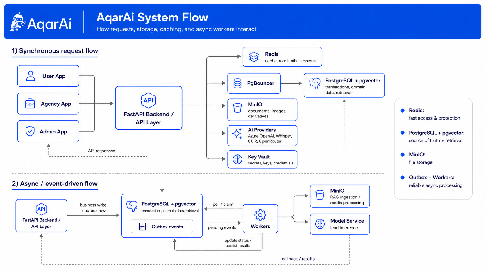

# AkarAI


AkarAI is an AI-first, multi-tenant real estate platform for Lebanon. It combines a FastAPI modular monolith, React user and agency apps, a Streamlit platform-admin surface, background workers, RAG-based policy assistance, media validation pipelines, and dedicated ML inference for lead processing.

This README is the project entry point. If you want the deeper technical breakdown, start with:

- [docs/architecture.md](docs/architecture.md)
- [docs/ai-ml-systems.md](docs/ai-ml-systems.md)
- [docs/decisions.md](docs/decisions.md)
- [docs/operations.md](docs/operations.md)
- [docs/quality-pipeline.md](docs/quality-pipeline.md)

## What The Project Contains

### Runtime surfaces

- `apps/user/`: public user experience for browsing listings, AI-assisted search, voice search, saved items, and comparisons
- `apps/agency/`: agency dashboard for listings, leads, viewings, RAG policy docs, and AI drafting workflows
- `admin/`: Streamlit platform-admin dashboard for aggregate marketplace insights, RBAC visibility, AI audit logs, and RAG eval visibility
- `backend/`: FastAPI modular monolith and the source of truth for auth, domain logic, AI orchestration, RAG, audit, and APIs
- `workers/`: background event handlers for RAG ingestion, listing media processing, and async follow-up work
- `model-service/`: dedicated lead inference service for spam filtering and hot-vs-normal ranking

### Core stack

| Area | Choice |
| --- | --- |
| Backend | FastAPI + Python 3.11 |
| Frontends | React + TypeScript |
| Platform admin | Streamlit |
| Database | PostgreSQL |
| Vector search | pgvector |
| Pooling | PgBouncer |
| Cache / throttling / invalidation | Redis |
| Blob storage | MinIO |
| Secrets | HashiCorp Vault |
| Async processing | DB outbox + workers |
| LLM provider path | Azure OpenAI behind provider interfaces |
| Reranking | OpenRouter reranker |

## Architecture At A Glance

The system uses a modular monolith instead of early microservices. That keeps transactions, tenant isolation, and shared security rules in one place while still allowing independent runtime surfaces.



```text
User / Agency / Admin UIs
        |
        v
   FastAPI backend
        |
        +--> PostgreSQL + pgvector
        +--> Redis
        +--> MinIO
        +--> Vault-backed config
        |
        +--> Outbox events --> Workers
        |                       |
        |                       +--> RAG ingestion
        |                       +--> media moderation + blur scoring + WebP derivatives
        |                       +--> future async AI jobs
        |
        +--> Model service for lead classification
```

Inside `backend/app/`, each feature follows the same shape:

```text
router.py        HTTP layer
service.py       business logic
repository.py    persistence / CRUD
schemas.py       request/response contracts
models.py        ORM models
query_service.py optional read-optimized CQRS path
```

That separation is intentional:

- routers handle HTTP and dependency wiring
- services own business rules and transaction orchestration
- repositories own database access
- query services exist only where read models deserve their own path

## Main Product Capabilities

### 1. Search and discovery

- classic filtered listing search
- AI text-to-filter extraction
- Azure Whisper voice search
- listing comparisons
- paginated results with cache invalidation on listing mutations

### 2. Agency operations

- listing CRUD and listing media uploads
- lead capture and review workflows
- scheduled viewings
- agency-side RAG policy assistant
- AI-generated listing drafts, lead replies, and comparison summaries

### 3. Platform oversight

- aggregate marketplace demand insights
- redacted AI/audit activity review
- role and permission overview
- RAG evaluation visibility

### 4. Applied AI / ML

- RAG ingestion and retrieval for policy Q&A
- Azure Computer Vision OCR for spec-sheet extraction
- lead spam gatekeeper model
- hot-vs-normal lead ranking model
- listing-image NSFW moderation
- blur detection and image derivative optimization
- next-month transactions forecast artifact exposed to the agency dashboard

## AI And ML Systems

### RAG

Agency policy documents are uploaded as PDFs, stored in MinIO, parsed into pages, chunked with parent-page context plus FastCDC child chunks, embedded through Azure OpenAI, stored in pgvector, and retrieved with tenant isolation enforced end to end. Retrieval results can be reranked through OpenRouter before answer generation. Evaluation is wired through RAGAS-style metrics plus retrieval hit-rate and tenant-leakage checks.

Relevant implementation/docs:

- [backend/app/rag/service.py](backend/app/rag/service.py)
- [workers/handlers/rag.py](workers/handlers/rag.py)
- [scripts/ci/run_rag_eval.py](scripts/ci/run_rag_eval.py)
- [specs/009-rag-storage-and-ingestion-foundation/plan.md](specs/009-rag-storage-and-ingestion-foundation/plan.md)
- [specs/010-rag-retrieval-area-search/plan.md](specs/010-rag-retrieval-area-search/plan.md)

### Guardrails and redaction

AI outputs do not go directly from model to user. The project layers:

1. prompt-injection and out-of-scope detection
2. OpenRouter content-safety judging when configured
3. secret-pattern redaction
4. Presidio-backed PII redaction with regex fallback
5. bounded payload shaping before logs/audit/client responses

Relevant implementation:

- [backend/app/ai/guardrails.py](backend/app/ai/guardrails.py)
- [backend/app/ai/pii_redaction.py](backend/app/ai/pii_redaction.py)
- [backend/app/rag/redaction.py](backend/app/rag/redaction.py)

### Search AI

- text search uses the chat-provider interface to extract structured listing filters
- voice search uses Azure Whisper through the STT provider interface
- logs store sanitized queries and transcripts instead of raw unsafe payloads

### Lead intelligence

Lead processing is intentionally split into two stages:

1. spam gatekeeper
2. hot-vs-normal ranker for non-spam leads

This runs through a dedicated `model-service/` so inference dependencies stay isolated from the main API process and can scale independently.

Notebook and artifact references:

- [docs/artifacts/lead-classifier/stage1_gatekeeper_ml_training_pipeline_with_model_card.ipynb](docs/artifacts/lead-classifier/stage1_gatekeeper_ml_training_pipeline_with_model_card.ipynb)
- [dump/leadclassifier/stage1_gatekeeper_model_card.md](dump/leadclassifier/stage1_gatekeeper_model_card.md)
- [docs/artifacts/lead-ranker/lead_ranker_transformer_finetuning_with_model_card.ipynb](docs/artifacts/lead-ranker/lead_ranker_transformer_finetuning_with_model_card.ipynb)
- [dump/leadranker/lead_ranker_model_card.md](dump/leadranker/lead_ranker_model_card.md)

### Media intelligence

Listing photos go through:

1. file validation
2. NSFW moderation with `Falconsai/nsfw_image_detection`
3. blur scoring with Laplacian variance
4. WebP derivative generation for public-safe display
5. audit logging of accepted, warning, rejected, and failed outcomes

The blur detector is a particularly useful design choice: the project keeps the simpler Laplacian approach because the artifact comparison showed near-CNN quality without the extra training and runtime complexity.

Artifacts:

- [docs/artifacts/laplacian-vs-cnn/blur_laplacian_vs_cnn_kaggle_notebook.ipynb](docs/artifacts/laplacian-vs-cnn/blur_laplacian_vs_cnn_kaggle_notebook.ipynb)
- [docs/artifacts/laplacian-vs-cnn/cnn-vs-lapl-metrics.png](docs/artifacts/laplacian-vs-cnn/cnn-vs-lapl-metrics.png)
- [docs/artifacts/laplacian-vs-cnn/cnn-vs-laplacian-test-acc.png](docs/artifacts/laplacian-vs-cnn/cnn-vs-laplacian-test-acc.png)
- [docs/artifacts/laplacian-vs-cnn/laplacian-conf-matrx.png](docs/artifacts/laplacian-vs-cnn/laplacian-conf-matrx.png)
- [docs/artifacts/laplacian-vs-cnn/cnn-cof-matrx-clearornot.png](docs/artifacts/laplacian-vs-cnn/cnn-cof-matrx-clearornot.png)

### Forecasting

The agency dashboard also exposes a next-month transactions forecast from packaged artifacts. The training journey and dataset are documented in:

- [docs/artifacts/forcast-model/model_comparison_notebook_local.ipynb](docs/artifacts/forcast-model/model_comparison_notebook_local.ipynb)
- [docs/artifacts/forcast-model/LEB3443M022026-range - Number of Real Estate Transactions - augmented-1000-rows.xlsx](<docs/artifacts/forcast-model/LEB3443M022026-range - Number of Real Estate Transactions - augmented-1000-rows.xlsx>)

## Reliability And Security

- tenant isolation uses transaction-scoped RLS context
- JWT access + refresh tokens support refresh rotation and invalidation
- Redis is used for token blacklisting, session invalidation markers, rate limits, and cache invalidation
- Vault is the source for secrets at startup
- PgBouncer sits on the runtime DB path
- write paths use transactions and domain/audit event logging
- async work uses a DB-backed outbox with retry/backoff and dead-letter states
- inbox/outbox tables exist to support idempotent event consumption patterns

## Eventing And Async Work

The project uses a durable outbox pattern rather than best-effort fire-and-forget jobs.

- the backend writes business records and outbox rows in the same transaction
- workers claim pending events with `FOR UPDATE SKIP LOCKED`
- failures back off with jitter and eventually move to dead-letter
- the pattern is used for RAG ingestion, listing-media processing, and lead inference handoff

Relevant code:

- [backend/app/common/events.py](backend/app/common/events.py)
- [workers/outbox.py](workers/outbox.py)

## Documentation Map

- [docs/architecture.md](docs/architecture.md): module boundaries, data flow, RLS, CQRS, eventing
- [docs/ai-ml-systems.md](docs/ai-ml-systems.md): models, providers, RAG, media intelligence, notebooks, metrics
- [docs/decisions.md](docs/decisions.md): the notable technical choices and why they were made
- [docs/operations.md](docs/operations.md): local setup, CI/CD, services, quality gates, operational behaviors
- [docs/quality-pipeline.md](docs/quality-pipeline.md): deterministic quality slices and live RAG eval flow

## Quickstart

```bash
cp .env.example .env
docker compose up --build
```

Main local surfaces:

- backend: `http://localhost:8000`
- user app: `http://localhost:3000`
- agency app: `http://localhost:3001`
- admin app: `http://localhost:8501`
- MinIO console: `http://localhost:9001`

For the full command map, use [docs/operations.md](docs/operations.md) and [docs/quality-pipeline.md](docs/quality-pipeline.md).
