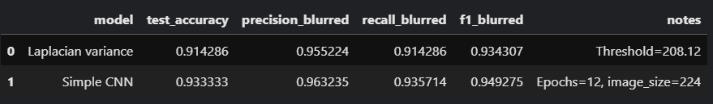
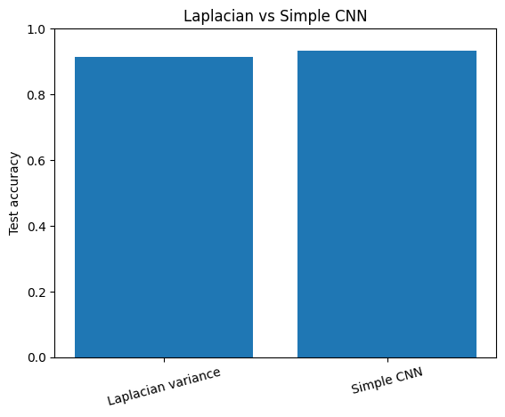
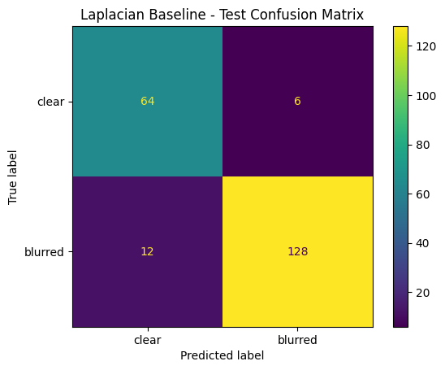
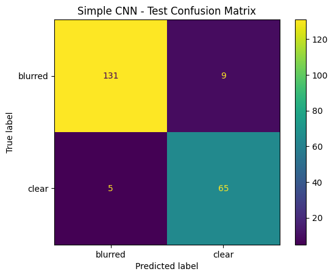

# AI And ML Systems

## Overview

AkarAI does not use a single generic "AI feature." It uses several specialized AI/ML paths, each with different latency, risk, and reliability requirements:

- search query understanding
- voice transcription
- RAG retrieval and answer generation
- OCR for listing spec sheets
- lead spam filtering
- lead hot-vs-normal ranking
- image moderation
- blur detection
- transactions forecasting

## Provider strategy

The project uses provider interfaces instead of wiring models directly into route handlers. That gives a stable abstraction for:

- Azure OpenAI chat and embeddings
- Azure Whisper speech-to-text
- Azure Computer Vision Read OCR
- OpenRouter reranking
- OpenRouter content safety

The key architectural point is that the backend owns provider calls. Frontends only talk to backend contracts.

## Search intelligence

### AI text search

Natural-language search is converted into structured listing filters through the chat-provider interface. The system returns a confirmed contract rather than letting the LLM directly drive SQL.

Why this matters:

- filter extraction stays reviewable
- logs remain sanitized
- rate limits stay backend-owned
- listing search itself still runs through standard domain query code

### Voice search

Voice search uses Azure Whisper through the STT provider interface. The output transcript is then passed through the same structured search-intent extraction path as text search.

Why Azure Whisper:

- backend-owned, consistent provider path
- same logging, throttling, and error handling model as the rest of the app
- avoids browser-only speech APIs that are harder to control operationally

## RAG system

### Ingestion design

RAG documents are:

1. uploaded as PDFs
2. stored in MinIO
3. parsed into page-level text
4. chunked using parent pages plus FastCDC child chunks
5. embedded through Azure OpenAI
6. stored in PostgreSQL + pgvector

Why FastCDC matters:

- chunk boundaries are more stable under document edits than naive fixed windows
- replace/reingest flows can detect reused vs new content more cleanly
- orphan cleanup becomes easier because content hashes remain meaningful

### Retrieval design

The retrieval path combines:

- embedding-based candidate search
- parent-page context fetch
- stale-chunk revalidation after replacements
- OpenRouter reranking
- guarded answer synthesis
- evidence and citation shaping

### Reranker

The project uses OpenRouter reranking in the retrieval path. It improves candidate ordering after vector recall without changing the underlying pgvector storage design.

The important design decision here is separation of concerns:

- pgvector handles recall
- reranking handles better ordering
- generation only happens after those steps

### Guardrails

Policy and agency generation paths share a guarded layer that blocks:

- prompt injection attempts
- out-of-scope requests
- unsafe outputs
- safety-judge failures when configured

The system can also route through NeMo Guardrails if enabled, but the default shared path uses provider abstraction plus OpenRouter content safety judging.

## PII redaction

The project uses a layered approach:

1. regex secret redaction
2. Presidio entity redaction
3. regex fallback if Presidio is unavailable
4. payload bounding and shaping

This is important because logs, audit rows, AI prompts, AI outputs, and retrieval evidence are all possible leak points. The implementation avoids fail-open behavior.

### Why Presidio

Presidio provides structured PII detection while still allowing a conservative fallback path. The code also deliberately limits noisy entity classes and uses a smaller spaCy model to keep runtime reasonable.

## OCR

Agency listing workflows can upload spec sheets and extract structured fields through Azure Computer Vision Read.

Why this path:

- OCR is provider-isolated
- temporary files are processed and discarded instead of stored durably
- extracted content can be fed into listing draft generation without turning the original upload into long-lived sensitive storage

## Lead models

## 1. Spam gatekeeper

Purpose:

- binary classify message as spam / non-lead vs real lead

Training notebook:

- [docs/artifacts/lead-classifier/stage1_gatekeeper_ml_training_pipeline_with_model_card.ipynb](artifacts/lead-classifier/stage1_gatekeeper_ml_training_pipeline_with_model_card.ipynb)

Model card:

- [dump/leadclassifier/stage1_gatekeeper_model_card.md](../dump/leadclassifier/stage1_gatekeeper_model_card.md)

Selected model:

- `linear_svc`

Dataset summary:

- 800 rows
- balanced labels: 400 spam / 400 lead
- TF-IDF on unigrams + bigrams

Selected test metrics:

- accuracy: `0.9938`
- precision: `0.9877`
- recall: `1.0000`
- F1: `0.9938`

Why it is interesting:

- the project did not overcomplicate stage 1
- a classical sparse-text pipeline was enough
- this is a good production tradeoff when recall is critical and latency should stay low

## 2. Lead ranker

Purpose:

- classify already-valid leads as `hot` or `normal`

Training notebook:

- [docs/artifacts/lead-ranker/lead_ranker_transformer_finetuning_with_model_card.ipynb](artifacts/lead-ranker/lead_ranker_transformer_finetuning_with_model_card.ipynb)

Model card:

- [dump/leadranker/lead_ranker_model_card.md](../dump/leadranker/lead_ranker_model_card.md)

Comparison summary:

- [dump/leadranker/lead_ranker_transformer_comparison_summary.json](../dump/leadranker/lead_ranker_transformer_comparison_summary.json)

Selected model:

- `answerdotai/ModernBERT-base`

Compared models:

- `answerdotai/ModernBERT-base`
- `microsoft/deberta-v3-small`

Observed result from the stored artifact:

- ModernBERT achieved perfect validation/test scores on the synthetic dataset
- DeBERTa v3 small collapsed to the negative class in this training run

That is exactly the kind of comparison worth documenting because it shows the model choice was empirical, not arbitrary.

## Image moderation and quality

### NSFW moderation

Model:

- `Falconsai/nsfw_image_detection`

Behavior:

- fail-closed if the model or token path is unavailable
- safe/rejected decision stored with audit detail

### Blur detection

Approach:

- Laplacian variance

Why Laplacian over CNN:

- the artifact comparison shows it gets nearly similar blur-detection quality
- it avoids training, serving, and maintaining an extra CNN
- it is cheaper to run in the media pipeline
- it is easier to explain, calibrate, and troubleshoot

Notebook and figures:

- [docs/artifacts/laplacian-vs-cnn/blur_laplacian_vs_cnn_kaggle_notebook.ipynb](artifacts/laplacian-vs-cnn/blur_laplacian_vs_cnn_kaggle_notebook.ipynb)
- 
- 
- 
- 

Production conclusion:

- keep Laplacian
- use the calibrated threshold already in config
- spend compute where it matters more than blur detection

## Forecasting

The agency dashboard exposes a next-month transactions forecast from packaged artifacts.

Notebook:

- [docs/artifacts/forcast-model/model_comparison_notebook_local.ipynb](artifacts/forcast-model/model_comparison_notebook_local.ipynb)

Dataset:

- [docs/artifacts/forcast-model/LEB3443M022026-range - Number of Real Estate Transactions - augmented-1000-rows.xlsx](<artifacts/forcast-model/LEB3443M022026-range - Number of Real Estate Transactions - augmented-1000-rows.xlsx>)

What the notebook documents:

- dataset hashing
- chronological split
- time-series feature engineering
- multiple model comparison
- model-card generation

Runtime note:

- the backend currently reads packaged prediction artifacts and exposes them through the agency dashboard
- the service is configured to use `lightgbm` rows from the stored artifact file

## Evaluation and quality

RAG quality is not treated as a vague "looks good" problem. The project has:

- deterministic quality slices for CI
- live RAG evaluation support
- RAGAS-style metrics
- hit@1 and hit@5 retrieval metrics
- tenant-leakage checks
- latency thresholds

The evaluator intentionally disables runtime content-safety judging during the judge run so it measures retrieval/answer quality instead of safety-provider availability noise.
